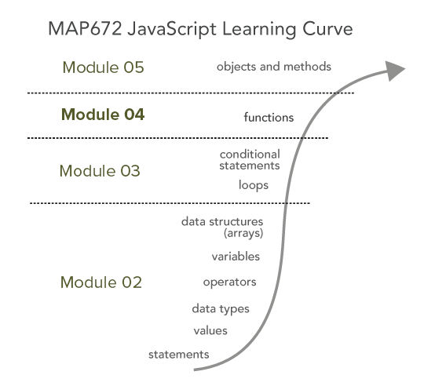

# Lesson 04: JavaScript Functions

## Goals

You will begin to make blocks of code called functions that can be written once and used multiple times. You will discover that functions can help you write concise code and develop a better-organized program.

## Table of Contents

<!-- TOC -->

- [Lesson 04: JavaScript Functions](#lesson-04-javascript-functions)
    - [Goals](#goals)
    - [Table of Contents](#table-of-contents)
    - [Overview](#overview)
    - [Defining functions](#defining-functions)
        - [Writing function declarations](#writing-function-declarations)
        - [Writing function expressions](#writing-function-expressions)
    - [Passing arguments and using function parameters](#passing-arguments-and-using-function-parameters)
        - [Return values](#return-values)
    - [Function scope](#function-scope)
    - [Example: functions and the "flow of execution"](#example-functions-and-the-flow-of-execution)
    - [Addendum I: Creating a game of chance](#addendum-i-creating-a-game-of-chance)
    - [Addendum II: Arrow functions](#addendum-ii-arrow-functions)
    - [Resources and Additional Reading](#resources-and-additional-reading)
    - [Glossary](#glossary)

<!-- /TOC -->

## Overview

When a computer program runs, there are often chunks of code (groups of JavaScript statements) that are all related and work together to accomplish specific functionality within the overall program. And often, we want to execute these at particular times, more than once and repeatedly. Within this lesson, we'll learn how we make our programs more efficient through the use of **functions**. We'll first learn how we declare and define functions. Then we'll make functions more powerful by passing information to them and receiving information in return.

  
*JavaScript learning curve*

We're quickly ascending the JavaScript learning curve, and functions are a powerful tool you'll soon enjoy using.

To begin, open the *lesson-04/index.html* file and start editing using the examples in the lesson below. Examine the output in the Console and comment on the examples as you go (**1 pt**). You can, of course, comment out statements that you're already completed.

When done, read and follow the [Lab 04 instructions](lab-04/).

## Defining functions

So far, we've been writing JavaScript code as one big unit of statements. The program runs top to bottom (except for looping structures), and as things get more complicated, the code begins to look a bit messy. This is where functions come in. As it is written in *[Eloquent JavaScript](http://eloquentjavascript.net/03_functions.html)*:

> "Functions are the bread and butter of JavaScript programming. The concept of wrapping a piece of program in a value has many uses. It is a tool to structure larger programs, to reduce repetition, to associate names with subprograms, and to isolate these subprograms from each other.  The most obvious application of functions is defining new vocabulary. Creating new words in regular, human-language prose is usually bad style. But in programming, it is indispensable."

Functions are, therefore, a fundamental building block of more extensive programs and act to bundle sequences of JavaScript statements together so they may run at specific times. Thus, rather than have 30 lines of code mucking around your program flow and confusing you, you bundle these lines into a function, store someplace more out of the way, and use one line to call it.

There are two ways of writing functions in JavaScript: either as **function declarations** or **function expressions**.

### Writing function declarations

First, let's cover the syntax for writing **function declarations**. We begin declaring a function with the keyword `function`, followed by the name of the function. Declaring a new function is very similar to the variable declarations using the `var` keyword. We also use camelCase naming convention for functions, similar to naming variables.

Here's an example of a simple function declaration.

```javascript
function helloMap() {
  console.log("Hello Map");
}
```

We would say that we've "declared a function named helloMap." One may also say that we've "defined" a function, which essentially means the same thing as declaring it.

Though you can begin a function with a letter or special character (such as an underscore or dollar sign), you should avoid using one of JavaScript's reserved keywords and other HTML object and property names as a function name. Here is a list of words to avoid when defining a function:

<pre>
abstract arguments await boolean break byte case catch
char class const continue debugger default delete do
double else enum eval export extends false final
finally float for function goto if implements import
in instanceof int interface let long native new
null package private protected public return short static
super switch synchronized this throw throws transient true
try typeof var void volatile while with yield
</pre>

Also required to write a function are two parentheses that immediately follow the function name (more about how to use these parentheses in a bit). Following the parentheses is a block statement written with an opening and closing curly braces. This pattern is similar to those used by the `for`, `while`, `if`, and `else` statements. We refer to the statements within a function's block statement as the function's **body**.

When you write this function into your script, save the file, and refresh the browser, you will not see the "Hello Map" logged to the Console. Why not? This `console.log` statement, contained within the function's block statement, has not yet been executed. We've written (or declared) a function. But it has not yet been executed, and neither has the statements within its body.

To get the statements within a function's block statement to run, we need to ** "call"** or ** "invoke"** the function. We call a function with a simple statement: the name of the function itself, including the two, required parentheses:

```javascript
// function is declared here
function helloMap() {
  console.log("Hello Map");
}

helloMap(); // this statement calls or invokes the helloMap() function!
```

Now you should see "Hello Map" logged to the Console in your browser.

We can think of the function as a piece of code that is waiting, ready to be executed whenever we wish to call it. We can call it multiple times, for example:

```javascript
function helloMap() {
  console.log("Hello Map");
}

helloMap();  // Console output will be Hello Map
helloMap();  // Console output will be Hello Map
helloMap();  // Console output will be Hello Map
```

What if we wanted to call a function 100s or even 1000s of times? We wouldn't want to write that function call statement that many times. Instead, we'd want to build a looping structure to call the function repeatedly within its block statement.

```javascript
// declare the function
function helloMap() {
  console.log("Hello Map");
}

// loop one hundred times
for (var i = 1; i <= 100; i++) {
  helloMap(); // call the function each time
}
```

Also, note that within the script, we can call the function before we declare the function. This technique is what's known as function "hoisting" and is different than writing *function expressions* (below).

```javascript
helloMap(); // this statement calls or invokes the helloMap() function!

function helloMap() {
  console.log("Hello Map");
}
```

It doesn't really matter if you declare the function before or after you call it in the script. Typically, we write our code by declaring functions in the order the script will invoke them, although this will change depending on how complicated the program gets.

### Writing function expressions

While we'll primarily be writing function declarations as we move forward, another way to write functions in JavaScript is through the use of a **function expression**. That is, rather than writing a stand-alone block of code as a function declaration, we can assign a function to a variable. Here is an equivocal function as above, written as a function expression:

```javascript
  var helloMap = function() {
      console.log("Hello Map");
  };

  helloMap();
```

The critical thing to remember when writing function expressions is that they must be written before they are invoked. The function is not "hoisted" as the function declaration is (above). Therefore, this will break the script:

```javascript
    helloMap();  // will throw an error

    var helloMap = function() {
        console.log("Hello Map");
    };
```

While not critical to fully understand yet, what's a practical example of why we'd use a function expression rather than a declaration? When we wish to nest a function within another one (which is quite allowable in JavaScript!), we need to use the expression approach to avoid issues in some web browsers that run JavaScript within a "strict" mode.

So if you find yourself needing to have a function within the body of another function, the following is the appropriate way to use a function within another. Write the following code and think carefully about how the code will execute. Which statement logging `message` will log to the Console first, the "I'm outside" or the "I'm inside"?

```javascript
function outerFunction(message) {
    console.log(message);
    var innerFunction = function(message) {
        console.log(message);
    };
    innerFunction("I’m inside!");
}
outerFunction("i'm outside!");
```

The flow of execution through this example is challenging to comprehend at first, so no need to worry if it doesn't click. Remember, we're learning a language, and sometimes it takes some more practice to get it! And for the time being, we'll primarily be writing and using function declarations and not function expressions.

One final note before moving on, you won't be writing many function expressions from your custom code. We do, however, use this approach quite a bit when using the Leaflet JS library. For example, we've seen this form when declaring our map object as a function expression:

```javascript
var map = L.map('map', {
  center: [38.0489, -84.5025],
  zoom: 8
});
```


## Passing arguments and using function parameters

So far, in this lesson, we've declared and called the most basic type of function. Mainly, the function receives no information when it's "called." It does something and does it once.

While this is helpful, functions can be much more useful when they receive information from the "caller," or the statement that calls or invokes the function. We can send data to the function when we call it. So rather than just doing exactly the same thing, the function uses a piece of data within its function body.

We refer to this as **passing arguments** to the function. An argument is an expression that is passed along to the function when we call that function. Remember those two parentheses we need to include when declaring and calling a function? A caller sends arguments by including them within those parentheses.

The function then receives these arguments (technically known as *parameters* as they enter the function) within its parentheses. Think of arguments and parameters a kind of variable that refer to values or expressions used within functions. We can name these whatever we want (as long as it is not a reserved keyword!), and they too follow the camelCase naming convention.

It's useful for you to learn and practice the precise terminology as defined here, as it will make following tutorials and examples more clear moving forward. It may be helpful to remember the following: "arguments" are like automobiles, and "parameters" are like parking spots. When you call a function, you send the argument or automobile. The function definition must be written to accept that automobile as a parameter. Each automobile needs a parking spot.

Consider this example (and then perhaps re-read the previous paragraphs):

```javascript
function saySomething(message) {  // function signature accepts information as a "parameter"
    console.log(message);
}

saySomething("Hello Map"); // function is called, passing an "argument" with it
```

This function is far more flexible and powerful than the previous one we created above. We can now pass any message we want to it:

```javascript
function saySomething(message) {
    console.log(message);
}

saySomething("Hello Map");
saySomething("Please enter the address you'd like to search for.");
```

Note that, in that example, we're passing a string value, `"Hello Map"`, as the argument, and the parameter `message` then refers to the value within the function's body. Often we use variables as arguments. This example is the same as above, but note how the variable name used to call the function is not the same as the world used for the parameter.

```javascript
function saySomething(message) {
    console.log(message);
}

var firstMessage = "Hello Map";
saySomething(firstMessage);

var secondMessage = "Please enter the address you'd like to search for."
saySomething(secondMessage);
```

**This is important and often confusing:** Even though the variable `firstMessage` (passed within the function call) and the paremeter `message` (used within the function definition) have  different names, they both refer to the same value.

But they need not be different words, and often we'll use the same word to keep things clear. So again, this example is functionally doing the same thing as above.

```javascript
function saySomething(message) {
    console.log(message);
}

var message = "Hello Map";
saySomething(message);

message = "Please enter the address you'd like to search for."
saySomething(message);
```

We can also pass multiple arguments to a function. We include them within the parentheses and separate them with commas. Let's say we want to write a function that calculates the area of a rectangle (such a function is a quasi-useful function for mapping as we often want to know the area of polygons). Of course, the world is not made of rectangular land areas, with the exceptions of various parts of the agricultural Midwest (we're looking at you Iowa!).  Still, you can begin to see how one might construct mapping-related functions. The function for calculating a square is:

```javascript
function calcAreaRect(width,height){
    var area = width * height;
    console.log(area);
}
```

We can then send two numeric values to the function. Note how they are incorporated into a JavaScript expression (`width * height`) and assigned to a variable within the function's block statement:

```javascript
function calcAreaRect(width,height){
    var area = width * height;
    console.log(area);
}

calcAreaRect(40,30);
```

Again, we often pass arguments to a function in the form of a variable:

```javascript
function calcAreaRect(width,height){
    var area = width * height;
    console.log(area);
}

var width = 40;
var height = 30;
calcAreaRect(width,height);
```

We can pass as many arguments to a function as we'd like, as long as the function's declaration (sometimes referred to as a function's "signature") specifies a parameter for each argument passed when the function is invoked. Again, every "automobile" (argument) needs a "parking spot" (parameter).

The order of the arguments passed corresponds to the parameter they are assigned to when they "reach" the function. In the previous example, the first value sent as an argument was assigned to the `width` parameter, the second to the `height`.

This is confusing and important, so let's again demonstrate that the names we use for arguments and parameters are not persistent. In other words, they do not stay the same between calling a function and passing along arguments and when they reach the function (and magically become parameters). The values they reference remain persistent.

The arguments passed to the function do not need to share the same name as function parameters (defined in the body of the function).  Again, ** it's the order in which they are passed** that really matters. So, we could have written:

```javascript
function calcAreaRect(width,height){
    var area = width * height;
    console.log(area);
}

var peanutButter = 40;
var jelly = 30
calcAreaRect(peanutButter,jelly);
```

The value of the variable `peanutButter` (40) is passed to the `calcAreaRect` function and assigned to the parameter `width`, which is then accessible as `width` within the function's block statement.

However, to keep things simpler and more transparent, we often use the same name for the arguments as the parameters to which they correspond. Just remember that we don't need to do so (yes, this section has repeated this a couple of times, but it seems to be a sticky point for newbie programmers).

### Return values

So far we've created more flexible and powerful functions by writing them to accept arguments and do something with these arguments within their body. After the function executes the statements within its body, the story ends there.

A function can become more useful, or "fruitful," by sending (or "returning") information back to its caller (the statement that invoked the function).  In computer programming, this is called "returning a value" as it provides useful information back to the statement that called it.

To do so, we use the `return` statement, followed by the value we wish to return.

```javascript
function calcAreaRect(width,height){
    var area = width * height;
    return area;
}

var calculatedArea = calcAreaRect(40,30);  // <-- the return value is assigned to calculated Area
console.log(calculatedArea);
```

Here, we are declaring a new variable `calculatedArea` and assigning it the return value from the `calcAreaRect` function. The function returns the value, it is assigned to the new variable, and then it is logged to the Console.

One thing to keep in mind with return statements is that statements within a function's body that are written below a `return` statement will not be executed. For example:

```javascript
function sayThings() {

    console.log("thing 1"); // will output to console
    console.log("thing 2"); // will output to console
    return;                  // returns an `undefined` value
    console.log("thing 3"); // will NOT output to console
}

sayThings(); // calls the function
```

Also, note that the return statement can only return a single element. If you wish to return multiple values, you can, for example, put them in an array and return that array (itself being a single element):

```javascript
function getMultiValues() {
    var value1 = 5;
    var value2 = "iguana";
    return [value1, value2];
}

var values = getMultiValues();
console.log(values[0]); // output is 5
console.log(values[1]); // output is "iguana"
```

## Function scope

So far in this lesson we've seen how functions are used to bundle chunks of code for use and re-use. Functions also provide an additional purpose within programming: that of establishing a **local scope**. That is, the variables created within a function's body exist (and are accessible) *only from within that body* or that particular function's scope. Within computer science, we refer to this packaging of related bits of code **encapsulation**.

In addition to the local scope defined within the body of a function, there is also the wider *global scope* of the HTML document itself.

Consider this example of code that would result in an error:

```javascript
function sayHello (){
    var greeting = "Hi, I’m a web mapper.";
    console.log(greeting);
}

sayHello(); // function call
console.log(greeting); // throws an error
```

While the variable `greeting` exists and is accessible within the function `sayHello()`'s body, that variable is unknown outside of that scope, in the global scope.  Therefore the second call to log `greeting` to the Console throws an error because within the global scope that variable has not be defined and is not accessible.  

This is useful because we can define and use variables within a function scope and not have to worry about them being computationally confused with variables outside that scope. For example:

```javascript
function sayHello(){
    var greeting = "Hi, I’m a web mapper."; // variable defined within the function scope
    console.log(greeting); // output is "Hi, I’m a web mapper"
}

sayHello();  // output is "Hi, I’m a web mapper"

var greeting = "Howdy, I'm a cartographer"; // variable defined within the global scope
console.log(greeting); // output is "Howdy, I'm a cartographer"
```

In this case, the `greeting` variable was not re-declared and assigned a new value. According to the program, these two variables are as distinct as `peanutButter` and `jelly` because they exist in different scopes (sometimes referred to as namespaces, though the **namespace** generally refers to the highest level scope).

However, that being said, objects within a global scope *are accessible* within a local scope contained within it.

Consider how this example is different than the preceding one?

```javascript
function sayHello(){
       console.log(greeting);
}

var greeting = "Howdy, I'm a cartographer"; // variable defined within the global scope

sayHello();  // output is "Howdy, I'm a cartographer"
```

In this case, `greeting` is defined in the global scope


## Example: functions and the "flow of execution"

The following example uses two functions to accomplish a trivial task (but highly applicable to this week's lab assignment). The `logNumsToConsole()` function will log each number in an array to the console. But before it does, it will send that number to another function to be doubled. The code within the `doubleNum()` function executes and returns the new value before the doubled number is logged to the Console.

```javascript
// we have three numbers
var myNums = [1, 2, 3];

// we want to log them to console
// so we call a function and send them into that function
logNumsToConsole(myNums);

function logNumsToConsole(nums){
  // function accepts that array as nums

  //for all of our numbers stored within nums array
  for(var i=0; i < nums.length; i++){
    // loop through each, i is a counter for each loop

    // before we log them, we want to double them
    var doubleNumValue = doubleNum(nums[i]); // i here access each one

    // THE NEXT LINE DOESN'T HAPPEN UNTIL ... the code within doubleNum runs!!!

    // now we log them
    console.log(doubleNumValue); // output is 2 4 6

  }  // end for loop

}  // end logNumsToConsole

function doubleNum(num){

  // for each number, we double it and return the value
  return num * 2;

} // end doubleNum
```

Functions, in particular, the passing of arguments, return values, and function scope, are conceptually challenge to grasp at first. With more practice reading and writing functions, we'll get the hang of them.

## Addendum I: Creating a game of chance

Many programming tutorials inevitably cover making your first game of chance with the language's random number generator. The finished code is found in the [lesson-04/coin-toss/index.html](lesson-04/coin-toss/index.html). Before you look at the solution, try to sketch out (or even write a finished script) that puzzles out the flow of execution and conditional logic. Here are the steps we need to consider:

1. Get user input for either "heads" or "tails". The example uses radio buttons to ensure the user selects exactly heads or tails. You could use the `prompt()` function to get user input, too.
2. Create two random numbers that are either zero or one, representing "tails" or "heads" respectively. One number will be the computer's pick and the other number will be the coin toss.
2. Compares the user's selection with the two random numbers and decide who is the winner. Here are the possible outcomes:
    1. If only the user selects the correct toss, then the user wins. 
    2. If only the computer selects the correct toss, then the computer wins. 
    3. If both the user and computer select the correct toss, then it is a draw.
    4. If both the user and computer select the incorrect toss, then no one wins.
3. The result is logged to the Console and/or added to an HTML element. 

We'll use the `Math` module and its `random` function to generate a number between 0 and (up to but not including) 1. We access the function using dot notation, `Math.random()`. We'll then use the `Math.round()` function to convert the number to a 1 or 0, representing heads or tails. 

It should be noted that this is not a truly random number, but it works really well for our purposes. How can we tell? Let's build a simple test to count the number of times the value "1" occurs. Consider the following function:

```js
// Let's test the pseudo-random method of making random numbers
runTest(1e6) // One million in scientific notation

// Function that counts the number of times "0" or "1" are picked randomly
function runTest(x) {
    let y = 0
    for (let i = 0; i < x; i++) {
        if (Math.round(Math.random()) == 1) {
            y += 1
        }
    };
    console.log(`${y/x*100}% are 1.`)
};
```

Because only two outcomes are possible (i.e., "1" or "0"), we should get very close to a 50% count of "1" the more times we run the test. Copy this entire block of code and paste it into your browser's Console. Try different values of `x` in the `runTest()` function. 

## Addendum II: Arrow functions

The JavaScript ES6 specification gave us `let` and `const` that we introduced in a previous module. Another feature introduced in ES6 is the [*Arrow Function*](https://www.w3schools.com/js/js_arrow_function.asp), also known as fat arrow functions, and has quickly become a popular way to write concise functions. For example, one parameter, single statement arrow functions do need the `return` or `function` keywords, curly brackets, nor parentheses. Let's consider the classic first function that prints, "Geography Y'all!" to the Console.

```js
// As a function declaration
// These functions are loaded before all other code.
// They are hoisted.
function hello() {
  return "Geography Y'all!";
}

// As a function expression
// Runs when program reaches this line of code.
// Not hoisted

const hi = function() {
  return "Geography Y'all! (A second time!) ";
}

console.log(hello(), hi())
```

We use the `const` variable because a function expression is always a constant value. Let's use the arrow function to create the same behavior. First, all arrow functions are limited function expressions and need to defined before they are called. We can remove the keyword `function` and add `=>` after the parentheses.

```js
const hiArrow = () => {
  return "Geography Y'all! (A second time!)";
}
console.log(hiArrow())
```

Because we have one statement in the function body, we can remove the keyword `return` and also remove the curly brackets `{}`.

```js
const hiArrow = () => "Geography Y'all! (A second time!)";

console.log(hiArrow())
```

If we wanted to add a parameter to this function, we can put it in the parentheses as normal. But, if we have only one parameter, we can omit the parentheses, too. This is "syntactic sugar!"

```js
const hiArrow = welcome => `${welcome}, Geography Y'all!`;

console.log(hiArrow("Stuck in Space"))
// output: Stuck in Space, Geography Y'all!
```

Arrow functions are best used for writing small, concise, and easily readable callback functions. Let's look at an example using the `.map()` [function](https://developer.mozilla.org/en-US/docs/Web/JavaScript/Reference/Global_Objects/Array/map) (more correctly it's called an array "method" and we'll address `methods` in a subsequent lesson). This `.map()` method will create a new array by calling a function on every element, in order, of an existing array. Let's take a look at a practical example.

```js
// define some measurements
const myMeasures = [45, 23, 9, 543, 7, 54, 23, 4]

// create a new array by iterating over each element and executing a function
const myValues = myMeasures.map(measures => {
  if (measures > 40) {
    return true
  } else {
    return false
  }
});

console.log(myValues)
// output: (8) [true, false, false, true, false, true, false, false]
```

The use of the arrow function in the `.map()` callback function makes it easier to read. The arrow function is anonymous, i.e., doesn't have a name, doesn't use the `function` keyword, and passes an argument called `measures` to access each element in the array. The argument name is arbitrary and only needs to conform to proper variable names. The function block uses `if/else` statement to create values in an array called, `myValues`. While the arrow function makes writing code like this less verbose, it is not a suitable replacement for all functions. Notably, the keyword `this` is handled differently in arrow functions and is a topic we'll address in a future lesson. 


## Resources and Additional Reading

* Chapter 3 of *Eloquent JavaScript*: [Functions](http://eloquentjavascript.net/03_functions.html)
* The Mozilla Developer Network's [Defining Functions](https://developer.mozilla.org/en-US/docs/Web/JavaScript/Guide/Functions)
* The w3schools [JavaScript Functions](http://www.w3schools.com/js/js_functions.asp)

## Glossary

* **function**: a set of reusable, self-contained statements of code that perform specific tasks (such as calculating and returning a value)
* **function body**: the statements contained within the curly braces of a function, also designating the functions "local scope"
* **calling or invoking a function**: the statement that "triggers" the function, passing optional arguments along with the call
* **argument**: the value passed to a function when that function is called
* **parameter**: the variable found within a function definition (and used within the function's body) to which an argument is assigned
* **return statement**: the statement within a function's local scope that terminates the sequence of statements within a function and returns
* **function or local scope**: corresponds to the statements contained within a function's body. Variables created within the local scope are not accessible outside of this scope (i.e., in the global scope)
* **encapsulation**: building together JavaScript statements for reuse and restricting access to these statements and values from outside that scope
