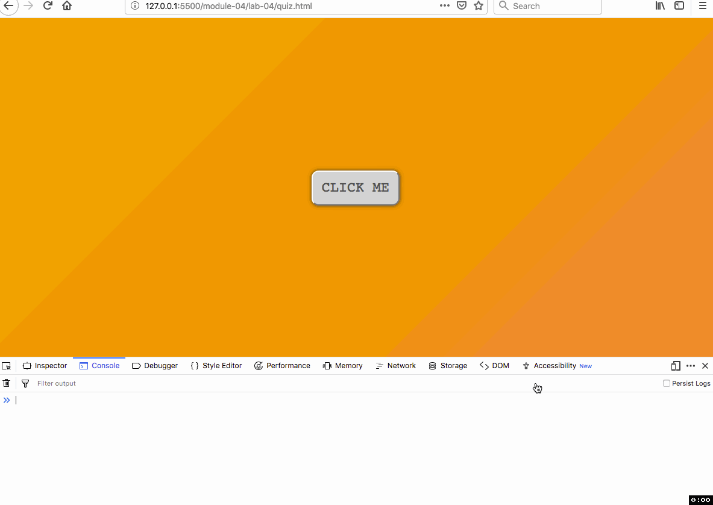

# Lab 04: Using JavaScript Functions

## Table of contents

<!-- TOC -->

- [Lab 04: Using JavaScript Functions](#lab-04-using-javascript-functions)
    - [Table of contents](#table-of-contents)
    - [Part I. Understanding the lesson (1 pt)](#part-i-understanding-the-lesson-1-pt)
    - [Part II. Quiz (3 pts)](#part-ii-quiz-3-pts)
    - [Part III. Using functions in our map script (6 pts)](#part-iii-using-functions-in-our-map-script-6-pts)
    - [Challenge: Add custom icons to weather camera map (+1)](#challenge-add-custom-icons-to-weather-camera-map-1)

<!-- /TOC -->

## Part I. Understanding the lesson (1 pt)

Run through the lesson _README.md_ and use the _lesson-04/index.html_ file to write/execute the statements presented in the lesson, and comment out statements that you're already completed. Commit changes as you go and push the index.html to your GitHub repo to backup, when you need help, and when you're ready to submit.

## Part II. Quiz (3 pts)

Create a new file named _quiz-04.md_ within your _lab-04/_ directory.

Answer the following questions and save them within the quiz-04.md file. Commit the file to your repository with a good commit message. 

Hint: write or copy/paste the code within your lesson `<script></script>` tags to look for errors, test, and puzzle out why the output is wrong.

1. Identify the function argument versus parameter in the following script.

```js
function randomNumber(x) {
    return Math.round(Math.random()*x)
}
randomNumber(100)
```

2. Identify which statement is a function expression and which is a function declaration. Show an example of using both functions that logs the function output to the console.

```js
function sayHello(name) {
    return `Hey, ${name}! It's Geography Y'all`
}

var helloYall = function(name) {
    return `Hey, ${name}! It's Geography Y'all`
}
```

3. Write a function that accepts a number value, squares that number within the function body, and returns the squared value to where the function was called (the "caller"). Assign the return value to a variable and log it to the Console.

4. Explain why the result is `"7"`.

```javascript
function testHigher(a, b) {
    if (a > b) {
        return a;
    } else {
        return b;
    }
};

var result = testHigher(7, "7");
console.log(result);
```

5. The following script throws an error (a "ReferenceError"). Explain why this error is thrown and provide a solution for printing out the capitalized name within the `console.log()`.

```javascript
var geographer = 'ptolemy';
function shoutName(geoName) {
    var capitalizedName = geoName.toUpperCase();
};

shoutName(geographer);
console.log(capitalizedName);
```

6. Modify the JavaScript function in [quiz.html](quiz.html) to make the button change color when it's clicked. The critical changes will be inside the function's `if` code block. Use the `console.log()` function to test and monitor changes.

    
*Example of page function in corrected question four*

## Part III. Using functions in our map script (6 pts)

To begin, first open the _lab-04/index.html_ file within your code editor. Inspect the contents of this file, and then open the file in your web browser using the live-server/Live Preview (and, as usual, open your web developer toolbar/Console as well).

You'll notice that an HTML UI button element has been added to the page, and has an id attribute of `map-cities` and display content of "Map Cities" (`<button id='map-cities'>Map Cities</button>`). You will also note that the map has no CSS applied. As you work through the JavaScript, decide what typeface and styles you might apply to this page.

The JavaScript contains some code that will listen for a user click event on this button. When the user clicks, the contents of the addEventListener's function (known as a "callback function") are executed. Specifically, a [JavaScript prompt function](https://developer.mozilla.org/en-US/docs/Web/API/Window/prompt) prompts the user to enter some text, and then assigns the string that's entered to the variable `units`. The code then logs that value of `units` to the Console. You should test this within your browser's Console.

```javascript
button.addEventListener("click", function() {

    var units = prompt('Enter the units for calculating density', 'Enter "miles" or "km"');

    console.log(units);

});// addEventListener callback function ends here
```

Test this code by typing strings into the prompt and looking for them in the browser console.

The goal of this task is to finish writing a script that:

1. after prompting the user to enter either 'miles' or 'km', stores this result in a variable
2. calls a function to make the map and sends this variable as an argument
3. uses a looping structure to populate the map with markers while building a popup that displays the name of each city and its population density

We'll create **2 functions** to achieve this. The module video and lesson addendum address using multiple functions to accomplish certain tasks. Follow these directions to continue.

1. Where indicated at the top of your script (below the code provided that creates the map and adds the tiles to the map), build 4 array structures to hold the names of 3 different cities of your choosing, their coordinates (lat/lng), their current population, and the area of each city. These will be similar to the arrays used in Lab 04; the cityCoords array will be a nested array. These arrays contain your data used for the map.

2. Within the `addEventListener()` callback function, replace the `console.log()` statement with a call to a function named `mapCities()` and pass the `units` variable as an argument. We wish to wait until the user has entered either 'miles' or 'km' before executing the code within the `mapCities()` function.

3. Immediately write a new function named `mapCities()` where the comments indicate. This function will need to accept the `units` variable as a parameter. Within this function's body, write code that loops through the `cities` array. Within this loop, you can access each of the city's population and area values (i.e., using `cities[i]` syntax, see Lab 04). Within the loop, call a second function named `calcPopDensity()` and pass the population, the area, and the units (which will be either 'km' or 'miles') as arguments. The return value from this function will be assigned to a variable named `density` (similar to how the `prompt()` function assigns the return value to the variable `units` above).

4. Now write the new function named `calcPopDensity()` where indicated (outside of the `mapCities` function's body!). This function needs to accept 3 values as parameters: a single city's population, its area, and the variable `units` designated within the `mapCities` function (i.e., 'miles' or 'units'). Write code within the function's body that accomplishes:
        
    a. First determine whether the units are in miles or kilometers using conditional logic, and then   
    b. Calculate the population density using the population and area values before returning the result to the caller (i.e., this value will be assigned to the `density` variable within the `mapCities` function). Your code within these conditional (if/else) statement bodies will need to mathematically convert the miles to kilometers if the value of `units` is changed to be 'km'.    
    c. Return the calculated density value

5. Once the `calcPopDensity()` is complete, save and test your code to ensure there are no errors. You may wish to write a `console.log()` statement beneath the line in the `mapCities()` function logging the returned value of the density to ensure it is valid.

6. Once you have the density value available to you within the `mapCities()` function loop, you can then build up the markers and popups in a similar fashion as in Lab 03. There will be one variable named `popup` that contains the content of the popup, which should include the name of the city and the density of the city. The coordinates will be used to place each marker in its correct position.

When you are finished with the interactivity, let's revisit the style and adjust column widths, colors, typeface, and any element you want to style. Think about when a visitor first sees your page; the first impression has significance and one that you can largely control with simple design and base map choices. Feel free to use any templates you have developed in the past.

When you are ready to submit, be sure that your code is clean and uniformly indented. For example, use your code editor's beautify function! Commit to Git periodically with meaningful commit messages. Finally, push your final solutions with the lesson repository and provide a link in Canvas by the due date.

**Consideration:** Note how if the user enters information incorrectly (a value of something other than 'miles' or 'km' for the unit), the script essentially breaks and the page must be reloaded. How would you go about catching these errors and again prompt the user to enter the correct information? Hint: consider using a looping mechanism and read about the [do ... while statements](https://developer.mozilla.org/en-US/docs/Web/JavaScript/Reference/Statements/do...while). This is an example in the supplemental video for this week.

## Challenge: Add custom icons to weather camera map (+1)

This challenge continues to work on our weather station map created in lab 03 and works with custom icons, a preview of our next module. To get started, use your solution to the lab 03 challenge or the code provided in the *challenge* folder. A supplemental video provides a solution for last weekends challenge and how to apply styles to images.

Next, we need to classify our weather stations by type (the classification is up to you, e.g., by elevation, the direction the camera faces, whether they are active, etc.) and then assign a URL to the icon you wish to show on the map. We'll use Scaled Vector Graphics (SVG) icons in this example. SVG files are written in plain text like HTML and can be easily edited. We will explore this in more detail in a future lab.

**Step 1**: Download MapBox's [Maki icons](https://www.mapbox.com/maki-icons/) and extract them into your repo. Your icons should now be in a folder called "svgs". Alternatively, you can create your own icons in a graphics editor. It's up to you!

**Step 2**: Add two arrays that classify your locations and give appropriate icons for the locations. This second array supplies the URL for the icon, which is the directory path to the icon SVG relative to the _index.html_. Make sure the position of your type and icon correspond to the correct location!

```javascript
// Group your locations into categories for symbology
const typeLocation = ["Type 1", "Type 2", "Type 3"];

// Give URL for custom icon
const typeIconURL = ["svgs/type-1.svg", "svgs/type-2.svg", "svgs/type-3.svg"];
```

**Step 3**: Create a function that checks for the type of location and then builds the icon object and returns it the `for` loop you created to populate your map with locations.

```javascript
// Iterate through array using indexes to access values
for (let i = 0; i < nameLocation.length; i++) {

// Build the location popup
const locationPopup = `<h2>${nameLocation[i]}</h2> ${detailsLocation[i]}`;

// Build Leaflet icon by calling a function to determine type of location
const iconLocation = createIcon(typeLocation[i]); // Function call

L.marker(coordinatesLocation[i], {
            icon: iconLocation // Insert returned function value
        })
        .addTo(map)
        .bindPopup(locationPopup);
};

// Function to determine type of location and return appropriate Leaflet icon object

function createIcon(typeOfLocation) {
  let iconURL = "", // declare the iconURL
      iconSize = 30; // create default size

  if (typeOfLocation == "Type 1") {
      iconURL = typeIconURL[0];
  } else (typeFacility == "Type 2") {
      iconURL = typeIconURL[1];
      iconSize = 40;
  };

  // Create a Leaflet icon object
  let result = L.icon({
      iconUrl: iconURL,
      iconSize: iconSize,
      popupAnchor: [0, -15] // Center of your icon is [0,0]
  });

  // Function returns a properly formatted Leaf icon object to place on your map
  return result;

};
```

Your map should now have custom icons for your locations!


